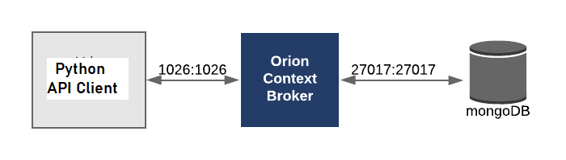

# Fiware
### General introduction to fiware and the Orion Context Broker
Fiware is an open source technology used for developing Smart solutions such as  for managing context information. Take a Internet of Things based Smart Solution, context information is usually data provided by different devices.
Within the context, each device is represented as an entity.

FIWARE therefore can be presented as a collection of open source software platform components which can be assembled together and with other third-party components to build platforms that support the development of Smart Solutions faster, easier and cheaper.

For a solution to be labeled as a "Powered by FIWARE" solution, there is one mandatory component that it must implement and that is the FIWARE Context Broker Generic Enabler.

### FIWARE-NGSI v2 API
The NGSI API is exported by the FIWARE Context Broker. The API is used by any "Powered by FIWARE" solution platform for the integration of different platform components.
### Context Management
The FIWARE-NGSI v2 API uses the Orion Context Broker, a Powerful REST API, to perform CRUD operations on Context Information and subscribe to changes on Context Information.

### Application: 
#### Context Management Using Orion Context Broker, MongoDB and Python REST API Client

The Orion Context Broker uses Mongodb to store context information. 
The API client accesses context data via the Orion API by help of REST CRUD methods
#### Requirements:
MongoDB Services (MongoDB container running on Docker)
```
docker pull mongo:4.2 docker
```
Fiware Orion Broker API service (Orion Container running on Docker)
```
docker pull fiware/orion 
docker network create fiware_default
```
Run containers
```
docker run -d --name=mongo-db --network=fiware_default --expose=27017 mongo:4.2 --bind_ip_all
docker run -d --name fiware-orion -h orion --network=fiware_default -p 1026:1026 fiware/orion -dbhost mongo-db
```
Install the required libraries
```
pip3 install -r requirements.txt
```
Run the python API client
```
python3 python/main.py
```
The main script implementation fetches context data from the Orion API using the GET method. 
The script can be modified to add other functionalities such as Fetching specific entities with a specified entity id, Use the POST method to add new entities and the PUT and DELETE methods